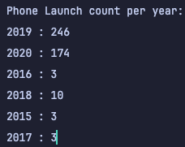

# Alternate Language Project - CSB 310
#### Author: Sandra Gran

(Access usually README info [here](#README)).

## 🤔 Which programming language and version did you pick?
Ruby 3.4.4

## 💡 Why Ruby?
Team Magma wrote their wikis on Ruby, and it sparked an interest in the
language. I was curious about its "There's more than one way to do it"
(TMTOWTDI) and "Everything is an object" philosophies. I also don't have a lot
of experience with scripting language in general, so I wanted to try one. 

## 🧬  How does Ruby handle...

Because a core Ruby philosophy is TMTOWDI, there are many routes to handling
things in Ruby. If you browse my code, you'll see I did not adapt one specific
style, but rather tried different things in different circumstances. I also
experimented with my IDE's (RubyMine) suggestions for making code more compact,
which taught me new operators and formats that I hadn't seen before!

### Object-Oriented Programming
The principles of object-oriented programming are:

#### Encapsulation
Following the encapsulation principle means grouping related methods and
attributes together into objects, and controlling their visibility via access
control. Ruby has two main types of objects, classes and [modules](#abstraction). 

Classes are Ruby's blueprint to make several instances of an object with the
same attributes and fields. Ruby has streamlined tools to make setting up
classes quickly and easy. Below is an example of a class with all of its setter
and getters already made.

```ruby
class Animal
    attr_reader :name
    attr_accessor :diet, :speak, :age

    def initialize(name, diet, speak)
        @name = name
        @diet = diet
        @speak = speak
    end

    def speak
        'Makes sounds'
    end
end 
```

Fields marked with `attr_reader` have a getter, and those marked with
`attr_accessor` have a getter and a setter. (`attr_writer` is a way to get only
a setter). Fields are created using the `@` symbol inside the constructor. All
fields *always* private, and can only be accessed via the accessor methods. 

Classes are *always* public for the namespace it's defined in. This means
classes as we would usually make them are public, and only nested inner classes
can offer classes that are private to the class they are defined in. 

Methods can be marked as public, private, or protected. (Protected methods in
Ruby are methods are can be called by other instances or subclasses, but can
only use that method internally. Protected methods could not be called outside
of the class.) Methods are given an access control marker using this syntax:

``` ruby

public

def method1
...
end

protected 

def method2
...
end

private

def method3
...
end

```

#### Inheritance

Ruby uses single inheritance model, via this syntax:

```ruby
class Dog < Animal
    def speak
        super + ' and barks!'
    end
end
```
All attributes and methods of all access control levels are inherited. Methods
can be overridden and parent methods can be accessed via the `super` keyword, as
seen in the example above. 

#### Polymorphism

Polymorphism is achieved by allowing different objects to respond to the same
method call at run time, but allow it to use code specific to its type. This
enables dynamic behavior at run time. 

**Polymorphism is the OOP attribute where Ruby shines the most**. Many language
support polymorphism via inheritance or interfaces, in Ruby this is not a
requirement. Ruby achieves this through duck typing, which essentially means if
a method can respond to it, it works. It doesn't concern itself with types.

To understand this let's consider an example in Java. 

```java
// Fails to compile!
public void log(String msg, Object o) {
    o.write(msg);
}
```
Even if the object, `o` that we pass has a write method, this would still fail
at compile time, because there is no `write` method for Object itself. If I
wanted several different objects to be able to respond in this way, I would need
to write an interface with a `write` method, and have all objects I wanted to
pass implement that interface, then use the interface as type to pass any object
that implements it.

In Ruby, if an object has that method, it can invoke it!
```ruby
### Anything with a write method will work as the actual parameter for object!
def log(msg, object) 
    object.write(msg)
end
```
#### Abstraction

The abstraction principle is about simplifying complex system, exposing on the
necessary information and hiding internal implementation. In languages like Java
this can be done via interfaces, but Ruby does not have these. It can provide
abstraction through modules, which allow a programmer to group alike methods and
properties in an object. Different from classes, modules cannot be instantiated.

Let's assume a and b are vector objects with fields `x` and `y`:
```ruby
module VectorUtil
    # adds two vectors
    def add(a,b)
        return [a.x + b.x, a.y + b.y]
    end
end 
```
For example, you might want to create a utility class to create operations on
vectors. The client could access these related methods without having to worry
about how they work, and know they would probably find what they need in this
module. 

Ruby also offers abstraction through procs and lambdas which allow you to give a
name to a function and use it as an object itself. 

And lastly, it offers abstraction through its highly simple syntax. To even the
programmer themselves, many details are abstracted away into a single word or
character. As we saw above, It only takes a single `@` symbol to create a field.

### File Ingestion

Ruby can handle file ingestion via its CSV library. This library has methods
that allow you to read files that are already csv's (via the `read` method). It
also has a method that would allow you to parse a string into a csv (via the
`parse`) method.

```ruby
@data = CSV.read(@file, headers: true)
```

Invoking the read method in the above way stores the data in such a way that you
can access data via the columns in the csv. These columns can be accessed via
their column name, which the method assigns from the order the headers are
written in, in the first row of the csv. 

### Conditional Statements

Ruby has classic conditional statement blocks like this:

```ruby
if condition
    # code if condition true
elsif condition_2
    # code if condition_2 true
else
    # code if none true
end
```

It also has the rare `unless` keyword, which is a conditional that triggers on false.

``` ruby
unless hungry
    puts "I'm not hungry"
end

# Above is equivalent to
if !hungry
    puts "I'm not hungry"
end
``` 

Ruby also supports a modified conditional statment for one-line conditionals:

```ruby
puts "Oh hello!" if condition

puts "Bye!" unless condition
```

Ruby also has ternary operators and case statements, like you see in other languages.

```ruby
# ternary example
hungry ? puts("Have a meal!") : puts("Just chill!")

# Equivalent to:
if hungry
    puts("Have a meal!")
else 
    puts("Just chill!")
end
```

### Assignment Statements

Ruby has the basic assignment operations that you would expect, plus some
interesting extras:

``` ruby
# 1. Normal assignment, nothing new to see here.
num = 25
```
```ruby
# 2. Compound assignment, also quite familiar.
count = 0
count += 1 
```

```ruby
# 3. Multiple assignment. Getting more interesting...
a, b = 5, 12

# Great for swapping!
a, b = b, a

# Can use to deconstruct arrays or hashes!
a, b = [289, 309]
```

```ruby
# 4. Conditional Assignment (?!?!)

# Assigns the value to name only if name is nil or false
# Great for not overwriting existing values!
name ||= "Cool Name" 

# Assigns a value to x only if x is truthy.
x &&= 10
```

Also, Ruby has simple syntax for adding to a collection:
```ruby
arr = []
arr << 1
arr << 2

# arr = [1, 2] 
```

### Loops

Ruby has all the expected loops, like for and while, in a usual style of syntax.

``` ruby
x = 0
while x < 5
x += 1
...
end

# 0..5 means between 0 (inclusive) and 5 (exclusive) stepping by 1
for i in 0..5
...
end
```

But also has equivalent syntaxes and variations on loops.

```ruby
# similar to while loop above
puts i += 1 while i < 5

# loop that continues to execute on false
puts i += 1 until i > 5

# call .times method on an integer to loop that many times!
3.times do
    puts "hello!"
end
```

The most "idiomatic Ruby" (Ruby purists love this phrase!) loop is the .each
loop, which is featured many times in my program. It allows you to iterate
collections very easily. 

```ruby
talk_arr = ["yes", "no", "hello", "very good"]

talk_arr.each do |word|
    puts word
end

# Can also be implemented in an inline format
talk_arr.each { |word| puts word }
```

### Subprograms

Subprograms are a key part of Ruby’s design. Referred to as methods, subprograms
in Ruby act as functions in behavior, that is, they always have a return value,
even if it isn’t specified. Methods implicitly return the last evaluated
expression if none is specified. (Or nil, if there is no suitable other return
value). There are many examples of this in my program!

``` ruby
def square(x)
    x * x # implicitly returned
end

puts square(3) # prints 3
```

Ruby passes parameters by pass-by-object-reference. 

Additionally methods themselves are first-order objects that can be passed as
parameters via closures. Ruby has three types of closures, blocks, procs, and
lambdas. The main difference between them is when and where they return while
running. 

### Unit Testing

Unit testing is done with either the built-in `minitest` library, or using the
`Rspec` library. `Rspec` is commonly used in the Rails community, and simplifies
unit testing with a very readable, English-like syntax. I chose to use
`minitest` for my project as it was already built in, I wasn't using Rails, and
its syntax felt close to Junit tests I had done in Java.  

To understand `minitest`, let's use an example from my project. Let's say we
already have a class `Util` with a method `float?`. A unit test could be created
using this syntax:

```java
require 'minitest/autorun'

class TestUtil < Minitest::Test

  def test_float?
    ...
  end

end
```
`minitest` supports lots of testing options, many of which I used, like:
```ruby
assert(condition) # valid if condition is true

refute(condition) # valid if condition is false

assert_equal(expected, actual)

assert_nil(value)

assert_raises(ExceptionClass) # test if an error is thrown

assert_in_delta(expected, actual, delta) # for testing floats
```

### Exception Handling

Ruby has some interesting options for exception handling. 

They can be handled in one-line statements:

```ruby
result = 7 / 0 rescue "infinity"
puts result # prints "infinity"
```

In large blocks that cover many cases:

```ruby
begin
    # process, may raise an exception
rescue
    # handles exception if it happens
else
    # executes when no error
ensure
    # always executed
end
```

Or in smaller blocks that only execute some of the above lines. 

## 📚 Libraries Used

To import a library in Ruby, the code line `require <name-of-library>` is used
before the class or method is declared. (This is seen in action in the [unit
testing](#unit-testing) example above). I did not venture outside of Ruby's core
and standard libraries for this project.

### CSV

The CSV library contains methods to read and write from CSVs. It also contains
methods to parse strings into CSVs. The `ingestor` class used this library to
read `cells.csv` then write to a new csv the cleansed data. 

### Math

The Math library is a core library that comes installed with Ruby. I used this
to calculate a square root for my sample standard deviation in my own utility
library.

```ruby
def self.standard_deviation(arr)
    mean = mean(arr)
    variance = arr.map { |x| (x - mean)**2 }.sum / (arr.size - 1)
    Math.sqrt(variance)
end
```

### Util (I wrote my own!)

To experiment with the module object, I wrote my own utility class that
performed some needed calculations:
- `float?`
    - To determine if an object was a float. This was handy for cleaning
      `features_sensors` and `platform_os` data, as these categories were to
      reject data that was only a number. 
- `mean`
    - To calculate the (arithmetic) mean of an array of numbers. Useful for
      creating aggregate data for `body_size` and `display_size` data.
- `standard_deviation`
    - To calculate the standard deviation of an array of numbers. Useful for the
      same reasons as mean. 

## ❓ Report Questions

### 1. What company (oem) has the highest average weight of the phone body?

**Answer**: HP with an avg body weight of 453.6. (They only had one phone, so
it's kind of an outlier).

[]

[]

[]


### 2. Was there any phones that were announced in one year and released in another? What are they? Give me the oem and models.

**Answer**: Yes, 3. Motorola One Hyper, Motorola Razr 2019, Xiaomi Redmi K30 5G

[]

[]

[]

### 3. How many phones have only one feature sensor?

**Answer**: 419, if we include V1 as a feature

[]

[]

[]

### 4. What year had the most phones launched in any year later than 1999? 

**Answer**: 2019 (246 phones)

[]

[]

[]

## README

## 🛠 Requirements

- Install Ruby version 3.4.4
- Clone or download the project folder

- Install RubyMine or another IDE for running `run.rb` or
- Navigate to the directory and run on the terminal, 
with command `ruby main.rb`.

- No dependencies were used, all imports are from standard Ruby library.

